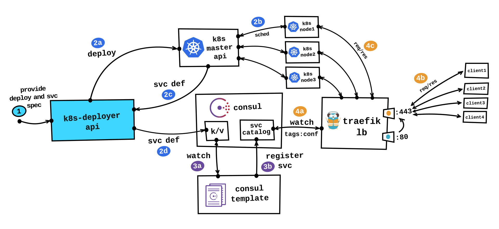

Kubernetes External Load Balancing with Traefik
===

About
---
Here I will explain it how you can utilize [Traefik](https://traefik.io) as Kubernetes external load balancer, before we can begin there are few prerequisites you have to fulfill, you must have already up and running:
- [kubernetes](../kubernetes/README.md) cluster on bare metal
- [supervisord](http://supervisord.org) process manager
- [consul](../consul-template/README.md) as you already know we're using [Consul](https://www.consul.io/intro/index.html) as K/V store and for service registration (consul catalog)
- [consul-template](../consul-template/README.md)
- [k8s-deployer](../README.md) API

```
+-----------------+-------------+-----------+--------------+
|    install on   | k8s masters | k8s nodes | traefik node |
+-----------------+-------------+-----------+--------------+
| supervisord     |      X      |     X     |       X      |
+-----------------+-------------+-----------+--------------+
| consul          |      X      |     X     |       X      |
+-----------------+-------------+-----------+--------------+
| consul-template |             |     X     |              |
+-----------------+-------------+-----------+--------------+
| traefik         |             |           |       X      |
+-----------------+-------------+-----------+--------------+
| k8s-deployer    |      X      |           |              |
+-----------------+-------------+-----------+--------------+
```


More in depth explanation
---


**1.** First we have to provide deployment and service specification to [k8s-deployer](../README.md) API (more about these specs [here](../README.md)).
Service spec is particularly important because it holds [Traefik's](https://docs.traefik.io/toml/#consul-catalog-backend) configuration parameters inside `annotations` hash.

Example `annotations` hash that can be found inside [echoserver.json](../examples/echoserver.json) spec file
```json
"annotations": {
    "traefik.enable": "true",
    "traefik.tags": "kubernetes",
    "traefik.frontend.rule": "Host:echoserver.example.com,echo.example.com;Method:GET,POST",
    "traefik.frontend.entryPoints": "http,https",
    "traefik.backend.loadbalancer": "wrr",
    "tags": "kubernetes,k8s,red"
}
```

Two types of keys are supported: keys that have `traefik.` prefix which, as you might presume, represent [Traefik](https://docs.traefik.io/toml/#consul-catalog-backend) configuration parameters and `tags` key which can hold comma separated list of misc values, basically you can set here whatever list of values (tags) you want, unrelated to Traefik.
The whole point here is that all these keys will be eventually added as tags to consul service during registration process.

Only `traefik.tags` key is required (`"traefik.tags": "kubernetes"`), value for this key must reflect what is defined in `constraints` line in Traefik's configuration file ([traefik.toml](./traefik.toml)), in our example this is `kubernetes` value, this way we've defined constraint which allows only consul services with `kubernetes` tag to be added to Traefik LB, all other services will be silently ignored.


**2a.** Create Kubernetes deployment and service objects

**2b.** Process of scheduling pods on the Kubernetes cluster

**2c.** k8s-deployer will receive service definition from Kubernetes master (service name, service nodeport, annotations...)

**2d.** Import service definition into the Consul key/value store


**3a.** consul-template will watch specified Consul tree in key/value store for changes and trigger registration process

**3b.** consul-template will register a new service in Consul service catalog


**4a.** Traefik will watch Consul service catalog over Consul HTTP API for new services, when a new service, with appropriate tag, arrives it will be added to Traefik LB. This way LB will receive all the required data, data about Kubernetes nodes (FQDN/IP) on which service is running, service port (NodePort) on which service is listening on and all configuration parameters collected through tags

**4b.** From this moment on service is ready to receive traffic from clients

**4c.** Traefik LB will balance traffic using defined balancing algorithm (wrr or drr) between Kubernetes nodes that have been added into the backend pool


Installation
---
I'm suggesting totally separated virtual or physical machine for Traefik, or you can run it inside the container, whatever works best for you.

Download [traefik](https://github.com/containous/traefik/releases) binary

Uncompress and move binary to appropriate location
```bash
mv traefik_linux-amd64 /usr/local/bin/traefik
```

Create directories for configuration and log files
```bash
mkdir -p /etc/traefik /var/log/traefik
```

Copy `traefik` configuration file

**Note:** basically you must change only path for cert and key files (entryPoints section) and default domain (consulCatalog section)
```bash
cp traefik.toml /etc/traefik
```

Now we can start `traefik` load balancer via `supervisord`

Create `traefik` configuration file for `supervisord`
```bash
cat > /etc/supervisor/conf.d/traefik.conf <<EOF
[program:traefik]
process_name=%(program_name)s
command=/usr/local/bin/%(program_name)s -c /etc/%(program_name)s/%(program_name)s.toml
directory=/etc/%(program_name)s
user=root
autostart=true
autorestart=true
redirect_stderr=true
stdout_logfile=/var/log/%(program_name)s/%(program_name)s-stdout.log
stdout_logfile_maxbytes=100MB
stdout_logfile_backups=10
stdout_capture_maxbytes=1MB
EOF
```

Start `traefik` service
```bash
supervisorctl reread
supervisorctl add traefik
```

---
Go back to main page [k8s-deployer](../README.md)
